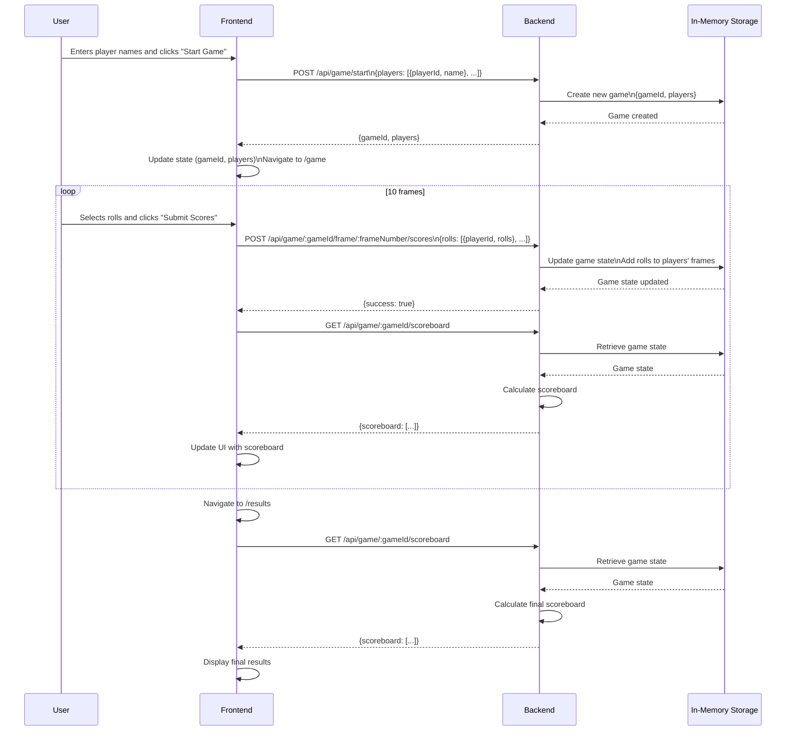
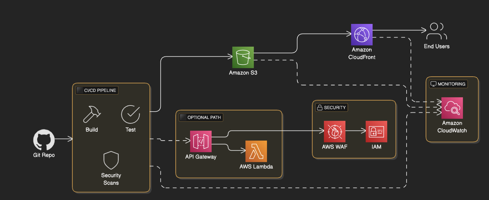
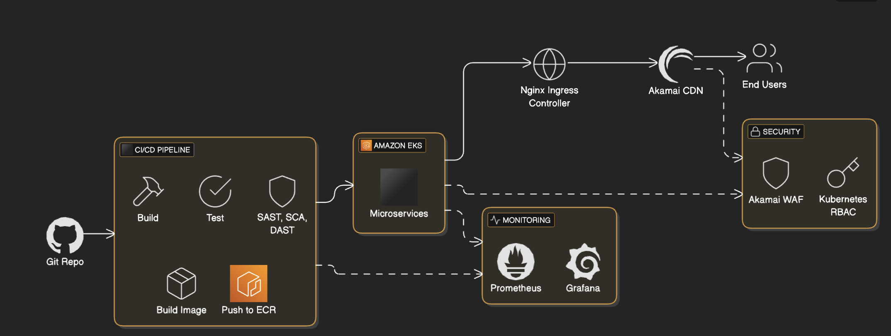
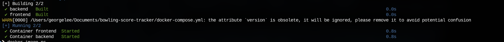
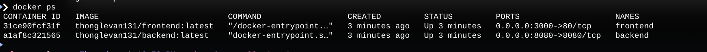

# Bowling Score Tracker

## Overview

The **Bowling Score Tracker** is a web application designed to help multiple players track their bowling scores across 10 frames. It adheres to standard bowling rules, including strikes, spares, and special 10th frame logic (e.g., third roll for strikes or spares). Players can start a new game, input their rolls, view a live scoreboard, and see the final results with winners highlighted.

### Features
- **Multi-Player Support:** Supports 2 to 5 players per game.
- **Bowling Rules:** Handles strikes, spares, and open frames, with special logic for the 10th frame.
- **Live Scoreboard:** Displays current scores for each player, updated after each frame.
- **Winner Display:** Highlights all players with the highest score as winners at the end of the game.
- **Input Validation:** Ensures valid roll inputs and prevents invalid submissions.
- **User-Friendly UI:** Built with React and styled with Tailwind CSS for a clean, responsive interface.
- **Environment Configuration:** Uses environment variables for easy configuration in different environments (development, production).

### Sequence Diagram



## Tech Stack
- **Monorepo Tool:** Turbo, Yarn
- **Frontend:** React, TypeScript, Rsbuild, Tailwind CSS, Shadcn UI, Zustand (state management)
- **Backend:** Node.js, Express, TypeScript, In-Memory Storage
- **Containerization:** Docker
- **CI:** Github Actions
- **Deployment:** Docker, Nginx, AWS EKS(PENDING), AWS S3(PENDING), AWS Cloudfront(PENDING)

## Prerequisites
Before setting up the project, ensure you have the following installed:
- **Node.js** (v18 or higher)
- **yarn**
- **Git**

## Setup Instructions
### 1. Clone the Repository
```bash
git clone https://github.com/your-username/bowling-score-tracker.git
cd bowling-score-tracker
```

### 2. Backend Setup

```env
# generate backend/.env
FRONTEND_URL=http://localhost:3000
PORT=8080
```

### 3. Frontend Setup
```env
# generate frontend/.env
API_URL=http://localhost:8080
```

### Install dependencies
```sh
yarn install
```

### Start Up (For development)
```sh
yarn turbo dev
```

### Start up with Docker

This repo is configured to be built with Docker, and Docker compose. To build all apps in this repo:

```sh
# Spin up with docker containers
sh scripts/docker-up.sh

```

Open http://localhost:3000.

To shutdown all running containers:

```sh
# Stop all running containers
sh scripts/docker-down.sh
```

# Deployment Strategy(High-Level)
## Option 1 CI/CD (DevSecOps), S3, CloudFront, and Related Technologies

### Flow
1. Code is committed to the Git Repository.

2. The CI/CD Pipeline builds the application, runs tests, and performs security scans (Static Application Security Testing - SAST, Software Composition Analysis - SCA).

3. Artifacts are deployed to Amazon S3.

4. Amazon CloudFront distributes the content to End Users.

5. For dynamic content, requests go through API Gateway to AWS Lambda.

6. Amazon CloudWatch monitors performance and health.

7. AWS WAF and IAM enforce security.

### Key Benefits

**Scalability:**
- S3 automatically scales storage capacity.
- CloudFront caches content at edge locations to handle traffic spikes.

**Reliability:**
- S3 provides 99.999999999% durability.
- CloudFront’s global network ensures high availability.

**Security:**
- AWS WAF protects against web threats.
- IAM roles enforce least-privilege access.
- Encryption secures data at rest (S3) and in transit (CloudFront).

## Option 2 CI/CD (DevSecOps), EKS, Nginx LoadBalancer, Akamai CDN



### Flow

1. Git Repository: Source code storage.
2. CI/CD Pipeline (DevSecOps): Automates build, test, and deployment with security scans.
3. Amazon ECR: Stores container images.
4. Amazon EKS: Managed Kubernetes for running containers.
5. Nginx Ingress Controller: Manages internal traffic, works as a sidecar in pod along with frontend static files.
6. Akamai CDN: Global CDN with advanced security features.
7. Monitoring: Prometheus and Grafana for observability.
8. Security: Kubernetes RBAC, network policies, Akamai WAF.

### Key Benefits

**Scalability:**
- EKS autoscales pods and nodes based on demand.
- Akamai’s global network handles traffic efficiently.

**Reliability:**
- EKS’s managed control plane ensures uptime.
- Akamai’s redundancy minimizes downtime.

**Security:**
- Kubernetes RBAC and network policies secure the cluster.
- Akamai provides DDoS protection and WAF capabilities.

## Comparison and Recommendations
- Option 1 (S3 + CloudFront):
  - Best for static or serverless applications.
  - Simpler to manage, cost-effective, and quick to deploy.
- Option 2 (EKS + Akamai):
  - Ideal for dynamic, containerized workloads.
  - Offers greater control and flexibility but with increased complexity.

# Records 
## Build spin up with docker with success
```
 sh scripts/docker-up.sh
```


#### Container is running


#### Demo (Happy Case)

https://github.com/user-attachments/assets/83cab59e-fd3d-43de-84ba-569b9aa6e220

# TODO

- [ ] Integrating Persistent Database (NoSQL)
- [ ] Update Code Coverage > 80, cover all important scenarios 
- [ ] Implement DevSecOps pipelines(CI and CD) that make the system scalable, reliable and secure

# Note and Warning

**I leverage the development speed by using AI tool. 
I am aware that I cannot depend on it, but recklessly validate its suggestion by critical thinking and analysis and my own experience.**    
